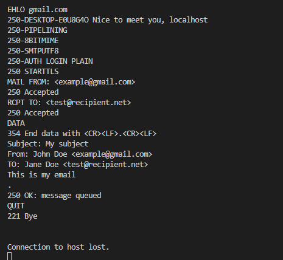
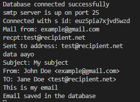

# Mail Server

This is a simple ```SMTP mail server``` made in nodejs to understand how SMTP mail servers work.
It uses "smtp-server" package.
## SMTP Commands
Each smtp commands defines a SMTP session:\
```handshake``` - establish TCP connection \
```email transfer``` - manipulations with emails \
```termination``` - closes TCP connection

### HELO/EHLO
In initaites the SMTP session. It's like a client greeting the server. HELO command is followed by domain name or ip address of the SMTP client server.
Example: 
```bash
HELO gmail.com
```

### MAIL FROM
It initiates the mail transfer. The MAIL FROM command is followed by the senders email address and give information to the server about the sender. Example:
 ```bash
MAIL FROM: <example@gmail.com>
```

### RCPT TO
It specifies the recipient of the mail. The RCPT TO command is followed by the recipient email address. Example: 
```bash
RCPT TO: <recipient@hotmail.com>
```

### DATA
It contains the date, subject, from, to, content text etc of the mail. The final line consist of ```.``` terminates the data transfer. Example: 
```bash
DATA
From: John Doe <example@gmail.com>
To: Jane Doe <recipient@hotmail.com>
Subject: This is smtp mail
This is the body text
.
```

### QUIT
It terminates the SMTP session. Server closes the channel with 221 response status then the client also closes the SMTP connection. Example: 
```bash
QUIT
```
<hr>
<div>Here is the mail sent to this server running locally using telnet</div>

  
<hr>




## Some DNS Records used in a mail server

### MX record
A DNS 'mail exchange' (MX) record directs email to a mail server. For example: for example@outlook.com its MX record will map it to its mail server lets say mailhost4.example.com.
[More about MX record](https://www.cloudflare.com/learning/dns/dns-records/dns-mx-record/) 

### A record
The MX record will give the mail server address now the A record indicates the IP address of the given mail server and return lets say 192.0.2.1. [More about A record](https://www.cloudflare.com/learning/dns/dns-records/dns-a-record/)

#### With these records we can identify the mail server that is sending the email. Now, we need some other record to check mail authentication.

### SPF record
SPF identifies the mail servers and the domains that are allowed to send email on behalf of your domain. It consist of the associated server names to the domain. The receiving server will check the SPF record to verify the servers allowed by your domain. Here, to get email from  example@outlook.com it will check in SPF if its coming from the server mailhost4.example.com(which exists in SPF of the domain). If not it may report it as spam or reject it. [More about SPF record](https://www.cloudflare.com/learning/dns/dns-records/dns-spf-record/)

### DKIM record
DKIM record helps prevent spammer from impersonating a legitimate domain. It uses [public key cryptography](https://www.cloudflare.com/learning/ssl/how-does-public-key-encryption-work/) to authenticate where an email came form. The email is signed with a private key of the user, the receiving server uses the public key published in the DKIM record to verify the source of the message. If someone tries to impersonate you, their private key and the public key in the domain's DKIM record will not match hence the mail could be reported as spam or be rejected. [More about DKIM record](https://www.cloudflare.com/learning/dns/dns-records/dns-dkim-record/)

#### These are some of the important records for checking for email authentication. Now, what to do after checking these records will be addressed by:

### DMARC record
DMARC record determines what should be done if the email check fails in SPF or DKIM record. For such email we can set ```p=xyz``` in DMARC record where xyz can be ```quarantine```, ```none``` or ```reject```. Quarantine helps to keep such emails in spam, none will let those email arrive to inbox and reject will simply reject such emails. [More about DMARC record](https://www.cloudflare.com/learning/dns/dns-records/dns-dmarc-record/)

